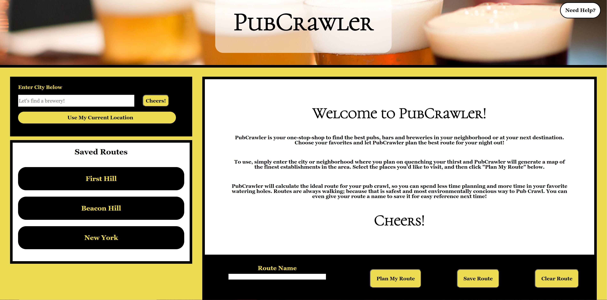
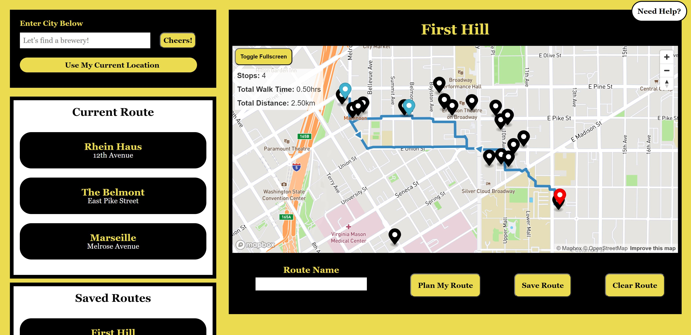
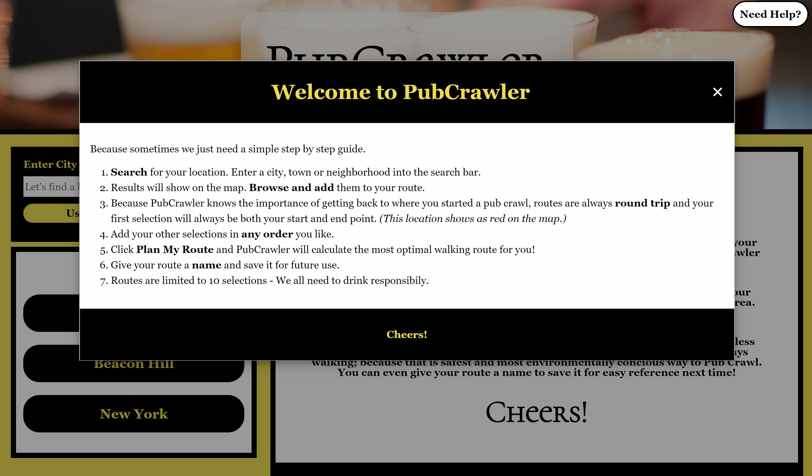
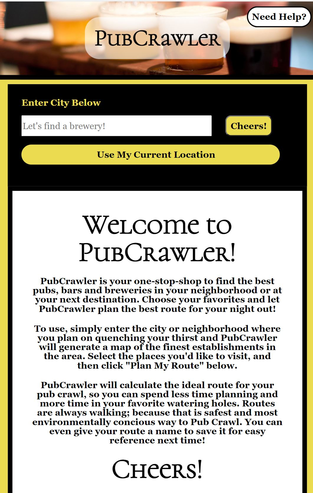

# PubCrawler
An app for curious drinkers with great taste.

Deployed Site:
https://benfok.github.io/pub-crawler

GitHub Repository: 
https://github.com/benfok/pub-crawler 

## Description
Our website allows users to enter a location, or use their current location, and be shown a map of the closest breweries. The user can select the bars they want to visit, and the app will map out the most efficient route for a pubcrawl to these locations. The user can save their favorite routes for later use. Perfect for planning a night out, a quick beer with a friend or for scoping out a location before heading to some boring work conference. 

## User Story (MVP)
AS A person who enjoys an occasional drink, and enjoys sampling and discovering local brews when I’m out of town

I WANT to be able to enter my location, or select my current one, and be shown a map with a list of places to get a drink nearby
SO THAT I can make decisions about where I want to enjoy my evening.

I WANT to select my starting location and choose other locations I would like to check out and be displayed with the most efficient route to visit them all
SO THAT I don’t spend unnecessary time transiting or figuring out directions

I WANT to finish back where I started, and the route should be optimized for walking 
SO THAT I don’t drive and get safely back in one piece 

I WANT to be able to save my created routes to a favorites list 
SO THAT I can easily revisit them later or pull them up when I am out on the town.

## Technologies
- PubCrawler is built using HTML, CSS and JavaScript. 
- All functionality and styling was achieved using vanilla JavaScript and CSS, without the aid of external libraries. 
- The information is pulled from the OpenWeatherMap, Geoapify and Mapbox APIs. 
  - OpenWeatherMap was used to return city and neighborhood locations for the user to choose from. PubCrawler can be used worldwide!
  - Geoapify Places API was used to then search based on the selected location and return results within certain categories (bars, pubs, breweries). The search returns the results sorted by ascending distance, within a 5km radius, with a maximum of 25. These limits are configurable on the back end.
  - Mapbox was used to render these locations onto a map, and to then create an optimized walking route between them. A helpful function of this is that, other than the first location always being the start and end of the route, it doesn't matter the order the others are added. We will optimize the route for the user.
- We added layers of functionality to the map, such as changing the color of chosen map markers to make it easier to visualize, statistics for your planned route and a custom full screen toggle to ensure that these layers were included when the map goes full screen.
- We leveraged localStorage to store saved routes, so that the saved map, markers and associated route can be recalled at any time.
- The site is fully responsive across all screen sizes. 

## Thoughts for Future Development
- Offer more information about each pub within the marker popup, including hours, reviews, etc. Possibly using the Yelp API.
- The ability to share saved routes with friends and to print a route.
- Selecting your own start and end points at separate bars, or at another location (for example your house).
- Expand the idea beyond pubs to include retail, restaurants or tourist attractions.
- Ability to edit the route as desired, and to more easily add and remove stops along the way.

## Collaborators
Built by:
- Ben Fok 
- Mike Fitzpatrick 
- Patric Seaman 
- Daniel Klotz 

## Screenshots

